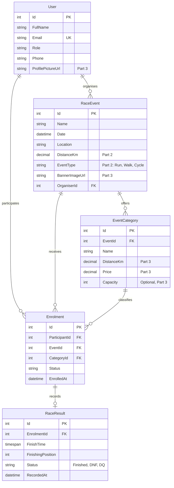

# RaceDay entity relationship diagram

```mermaid
erDiagram
    User ||--o{ RaceEvent : organises
    User ||--o{ Enrolment : participates
    RaceEvent ||--o{ EventCategory : offers
    RaceEvent ||--o{ Enrolment : receives
    EventCategory ||--o{ Enrolment : classifies
    Enrolment ||--o| RaceResult : records

    User {
        int Id PK
        string FullName
        string Email UK
        string Role
        string Phone
        string ProfilePictureUrl "Part 3"
    }
    RaceEvent {
        int Id PK
        string Name
        datetime Date
        string Location
        decimal DistanceKm "Part 2"
        string EventType "Part 2: Run, Walk, Cycle"
        string BannerImageUrl "Part 3"
        int OrganiserId FK
    }
    EventCategory {
        int Id PK
        int EventId FK
        string Name
        decimal DistanceKm "Part 3"
        decimal Price "Part 3"
        int Capacity "Optional, Part 3"
    }
    Enrolment {
        int Id PK
        int ParticipantId FK
        int EventId FK
        int CategoryId FK
        string Status
        datetime EnrolledAt
    }
    RaceResult {
        int Id PK
        int EnrolmentId FK
        timespan FinishTime
        int FinishingPosition
        string Status "Finished, DNF, DQ"
        datetime RecordedAt
    }
```

Distance fields use `decimal(8,2)` and category price uses `decimal(10,2)`. A `NULL` category capacity means unlimited entries.
